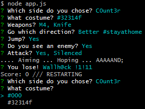

# CLI-Strike

Counter-Strike for the lazy

- [About](#about)
- [Installation](#installation)
- [Play](#play)

 

---

  

## About

Ever felt too lazy to install Steam and too noob-ish to compete?
Welcome to the emotionally rewarding and minimalist CLI version.

Perfectly suited as office game; when deploying stuff takes longer as it should,
or as valid anger management method when other stuff breaks after your shift ends.

### Features & Gameplay

- Scores
- Costume selection!
- Weapon selection!
- And so much more ...

  

## Installation

1. Install [node.js](http://nodejs.org/)

  

## Play

1. Open any kind of bash CLI
2. Navigate to the projects `src` folder
3. Run `node app.js`
4. Play

  

## Todo

- Build multiplayer
- Build highscores
- Await copyright infringement lawsuit

Still too much interface. Can't await a Pen & Paper version.

