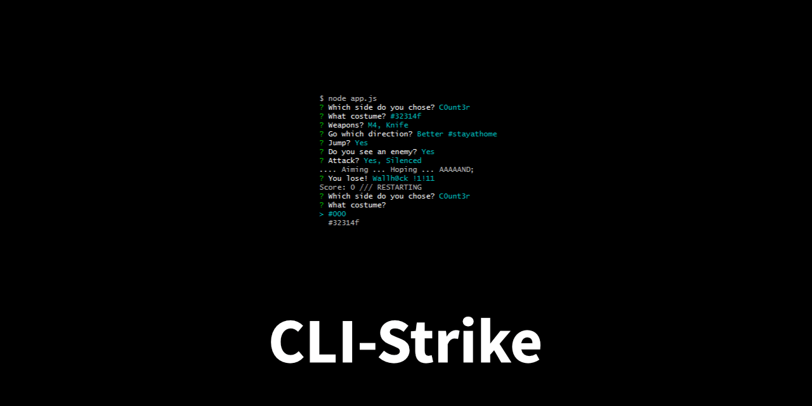

# CLI-Strike

Lazy gamers Counter-Strike.

> [!TIP]
> Proudly vibe coded since 2026. Neither reviewed nor optimized afterwards.

## About

This project acts as a low-cost, low-complexity tech playground.

It serves as an all-in-one location to drop in any other tech stack I'd like to explore;
to reduce the overhead of managing several repositories.

### History

- 2026: Zero-shot vibe-code port to Vue tech stack, no prompt engineering or context, an arbitrary model.
  - This was an experiment to see how far it can go without any guidance or context, to potentially apply the approach to other projects with legacy tech stacks.
- 2023: This project started as some long-forgotten office joke. Intended to test the Node plugin 'inquirer' and enhance the UI of work-internal toolings, the game was built around as a demonstration.

---

## Game

Ever felt too lazy to install Steam or compete online?
Welcome to the emotionally rewarding and minimalist solo-player version.

### Features & Gameplay

- Scores
- Costume selection!
- Weapon selection!

_And so much more …_
