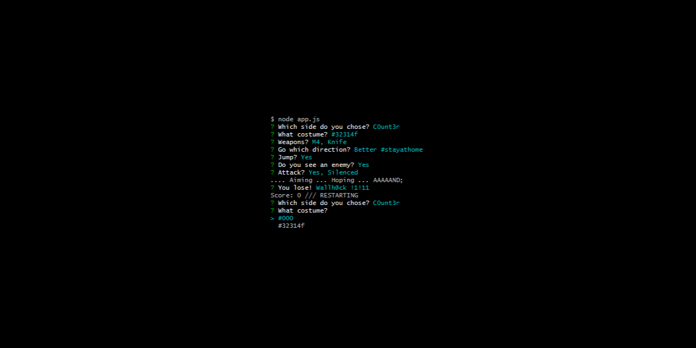

# Lazy gamers Counter-Strike

- [About](#about)
- [How to use](#how-to-use)
- [Todo](#todo)

 

---

 

  

## About

Ever felt too lazy to install Steam and too noob-ish to compete?
Welcome to the emotionally rewarding and minimalist CLI version.

Perfectly suited as office game; when deploying stuff takes longer as it should,
or as valid anger management method when other stuff breaks after your shift ends.

Probably still too much interface. Can't await a Pen & Paper version.

### Features & Gameplay

- Scores
- Costume selection!
- Weapon selection!
- And so much more ...

  

## How to use

### Setup

- [node.js](http://nodejs.org/)

### Run

1. Open any kind of bash CLI
2. Run `npm run start`
3. Play

  

## Todo

- Build multiplayer (could be as simple as round-based from same instance; else socket-based realtime?)
- Build high-score
- Build menu
